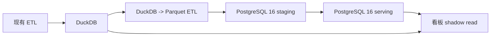

# L4.74 双写期方案

## 范围

双写期持续 1 个月，DuckDB 继续作为生产回滚源，PostgreSQL 16 作为 shadow/primary 迁移目标。

## 数据流

## 一致性校验

| 层 | 校验 |
|---|---|
| row count | orders / user_first_purchase / user_rfm_precompute |
| amount sum | actual_amount 日维度合计 |
| user count | distinct user_id 日维度 |
| RFM | r_interval 与 rfm_segment 抽样 |

## 切换条件

1. 连续 7 天核心表 row count 差异为 0。
2. 核心金额指标差异小于 0.1%。
3. 老客/RFM 10 个业务场景 P95 < 5s。
4. fallback 次数连续 7 天为 0 或有明确可接受原因。

## 回滚

保留 DuckDB read path 和原有 `.env` 配置。切换失败时把 data_source flag 改回 DuckDB，PostgreSQL 继续 shadow read。
