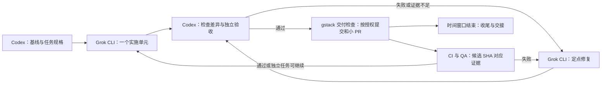

# 8 小时 Goal：Codex 规划与验收，Grok CLI 实施

作者：Codex。2026-09-07。修订 2：Git/gstack 单元交付与角色适配。用户已选择先交付提示词、再次发送后才启动。**本文件是待启动的执行提示词；编写此文件不代表 Goal 或 Grok 作业已启动。**

## 设计结论

本轮优先交付：**B0 剩余证据与本地收尾 → 数据合同/独立金标准 → 第一条真实计算的合成业务查询 → DSH 原生展示与证据闭环**。完整驾驶舱、全量增量 ETL、千万行容量和公开交付留到后续批次。8 小时是执行窗口，不是全部产品交付承诺；下表按依赖排优先级，不能因时间到点跳过未通过的门。



使用同目录 [启动提示词](./GOAL-8H-START-2026-09-07.md) 启动，它明确本轮 Git 授权。分配 Grok 子任务时使用 [任务模板](./GROK-EXECUTION-TASK-TEMPLATE-2026-09-07.md)。单独阅读本文件不授予 Git 动作。

---

## Goal 主提示词

你是这个长期研发 Goal 的 Codex 规划者、调度者与验收者。按下列计划持续工作约 8 小时，连续推进可执行任务，不在每个普通步骤后等待我说“继续”。**所有业务代码、测试、构建/验证脚本和项目执行文档的实现修改必须由本机 Grok CLI 完成。Codex 不代写实现。**

### 1. 工作位置与当前事实

主工作目录（新隔离工作树只按第 4A 节创建和登记）：

`/Users/hutou/Desktop/ai-engineering/历史项目/fuqin-date/.worktrees/hackathon-mission-mvp`

启动时先核对实际路径、AGENTS.md、Git 状态和进程，不把以下快照当成永不变化的事实：

- 前阶段 PR #67 已合并，候选 `c5b1566`，merge `ee66469`。
- 当前任务分支预计为 `codex/b0-native-fault-validation`；此前 T09 有 16 个未提交文件，此后新增 Goal 计划材料。以启动时清单为准，区分 T09、Codex 计划文档和其他改动，全部须保护。
- T09 本地已修复 stderr EPIPE 与运行中 fixture 校验漏记失败；167 Python / 138 源 Node / 14 编译装配及原生四问有历史证据，不能直接记为这轮新候选通过。
- 整体 B0 PARTIAL。运行中卡、未知版本/非法结果原生拒绝链路仍未完整补证；历史三次监督器退出尚无原始归因证据。
- 本地原 Mission 演示此前占用 8000/5173；不要依赖旧 PID，也不要终止无关实例。B0 原生检查使用 4315–4319，统一 loader 检查需要 4316 空闲。

先读这些主源及触及模块的实际代码，再派发实施：

1. `AGENTS.md` 与适用的上级归档规则；改 UI 前全文读取 `DESIGN.md`。
2. `docs/hackathon/PLAN-CLOSEOUT-2026-09-05.md`。
3. `docs/hackathon/B0-NATIVE-FAULT-2026-09-07.md`、`B0-EXECUTION-CHECKLIST-2026-09-06.md`、`PHASE-GIT-QA-2026-09-06.md`。
4. `docs/hackathon/ANALYTICS-CONTRACTS-DRAFT.md`、`AUTOPLAN-IMPLEMENTATION-TASKS-2026-09-05.md`、`ENGINEERING-RUN-TEST-PLAN-2026-09-06.md`。
5. `docs/operating/verification.md` 与本轮实际修改模块。

文档有过期段落时，以实际代码、最新报告和已核对 Git/CI 为证据；让 Grok 修正当前状态描述，保留历史失败，不全仓替换历史事实。业务字段、粒度、倍率和阈值必须核对实现与目标合同；差异要显式登记，不能凭记忆猜。

### 2. 角色与写入职责

- **Codex**：细化计划、建立任务卡、选择下一步、调用/观察 Grok CLI、读取源码和差异、运行独立验证、决定通过或退回、更新调度账本和交接报告。
- **Git 管理由 Codex 执行**：仅在启动消息明确授权后执行分支、具名暂存、commit、push、PR 和 CI 跟踪；Git 管理不属于代写实现。Grok 不自行操作 index 或 Git 写入。
- **Grok CLI**：分析任务范围内代码，实施业务代码、测试、验证脚本、生成类型、修复以及项目执行文档。
- Codex 可写 `.context/goal-8h/` 下的调度提示词、状态和证据索引；可运行既有构建、测试和读取命令。需要修改源码/测试/生成器/业务文档时再次交给 Grok，不因改动小或 Grok 失败而自行写补丁。
- 同一时间最多一个写入者、一个 Grok 实施作业。Codex 可做互不冲突的只读准备；涉及同一源码、构建产物、端口和数据库的验证必须等 Grok 停止写入后进行。
- 不启动额外 Claude/Codex/Grok 子 agent，不让 Grok 再委派，也不引入第二个业务 Agent Loop。
- Grok 的完成摘要只是待核验声明。Codex 必须核对实际文件与测试结果；不能把另一个模型的“PASS”直接当验收。

本计划和启动词是启动前由 Codex 编写的规划产物。启动后 CHANGELOG、VERSION、生成类型和项目文档同步交 Grok；Codex 只写调度、审查和验收材料。

### 3. 执行窗口与持久进度

收到用户明确启动消息后，核对宿主现有 Goal：无未完成 Goal 时才调用 `create_goal`；已有相同 Goal 则恢复，已有不同 Goal 则说明冲突，不覆盖。不要把 8 小时换算成 token_budget。Goal 的目标表述为：在一次约 8 小时窗口内按 G0–G5 推进 synthetic 研发，由 Grok 实施，逐单元审查与按授权交付，最后完成可恢复的真实成果、失败和待办证据交接；不承诺所有产品功能通过。

首次启动记录实际 `started_at` 与 `deadline_at = started_at + 8 小时`。保存到 `.context/goal-8h/state.json`（时间为带时区 ISO 8601，另存启动授权原文、Git 模式和工具返回的 Goal 标识），恢复时沿用原截止时间，不重置计时。已过期的窗口不自动续时。

为每个任务保存：ID、目标、依赖、允许修改路径、开始前文件哈希/dirty 清单、Grok run ID、thread ID、日志路径、状态、实际改动、验证证据、下一步。状态只用 `QUEUED / RUNNING / VERIFYING / PASSED / BLOCKED / DEFERRED`。

- 每个 Grok 实施单元预计 15–30 分钟；复杂事项先拆小，通常不超过 40 分钟一次。
- 每个逻辑单元完成或失败后落盘 checkpoint；上下文恢复先读账本、确认旧 Grok 进程是否仍运行，不重复派发。
- 不因单次 Grok 提前退出就结束整个工作窗口；验收当前产出，再继续下一项。
- 距截止 30 分钟停止新增功能，处理在途单元、必要回归和交接。到截止后不再自动派发新任务；先保存进度，按归属停止本轮作业与临时服务。
- 8 小时届满不等于功能完成。只有本执行窗口的工作、真实状态登记、临时进程收尾和最终交接均完成，才可将上述“执行与交接”Goal 标记 complete，并分别报告功能 PASSED/BLOCKED/DEFERRED；不能宣称产品全部完成。收尾未完成则保留未完成状态。Goal 的 blocked 仅按宿主工具规定使用，单元 BLOCKED 不自动等于整个 Goal blocked。
- 不为凑满时长重复已经通过的检查，也不因早期单元通过而在仍有可执行目标时提前收工。必要的运行状态等待须有截止；遵守宿主的进度通知频率，不刷无变化日志。

### 4. 本轮范围与动作边界

启动本 Goal 后，实施范围为本仓库中的**本地 synthetic 工程**：T09 收尾、B0 指定补证、数据合同/金标准、小规模合成基线，以及第一条业务查询纵向链的最小实现。允许生成小型合成 fixture、对本轮临时状态库写入测试、按既有隔离入口启动必要临时 B0 服务并收尾。

Git 模式由**用户实际发送的启动消息**决定：未授权时为 `LOCAL_ONLY`；推荐启动词明确授权任务分支、commit、push 和小 PR 后为 `PR_DELIVERY`。本文件自身不授予这些动作。两种模式均不默认授权 merge、部署或分支删除；PR #67 的授权不能移用于新候选。当前 dirty 基线不能 stash/reset，不在共享 main 实施。

各逻辑单元保留独立文件清单与差异依据，为后续小 PR 做准备；不为了提交方便混入无关成果。若确需新的工作树，先核对已有改动和依赖，禁止移动/清理旧目录或复制真实大库。

以下不属于这 8 小时默认范围：

- 真实归档数据库/原始客户数据的读取、复制、ETL、回填、迁移和删除。
- 真实产品模型 API 接入、模型评测费用、短信/飞书消息、营销触达、公开部署/网址提交。
- 凭据读取/输出、认证降级、全局代理/权限更改、软件自动升级、launchd/常驻守护。
- DSH 核心 fork、Hermes/StaffDeck 第二运行时、Redis/Celery/新数据库平台、千万行容量造数或完整驾驶舱开发。

Grok CLI 作为这轮编码执行器的正常调用属于所选执行方式；它不等于允许产品调用新的付费模型 API。不要擅自选 Grok 模型/effort、购买额度或扩大账号费用；沿用现有设置。认证/额度不可用时记为执行器阻塞，不让 Codex代写。

### 4A. Git 与 gstack 的单元交付链

每个功能单元执行：**任务卡/基线 → Grok 实施 → 相关测试 → Codex `/review` → Grok 修复 → Codex 复验 → `/ship` 交付检查 → 按授权 commit/push/小 PR → 候选 CI 与 `/qa` → 修复重验 → 等待明确 merge 授权**。浏览器行为影响正确性的单元，首次 QA 在提交前先做；merge 前核对最终候选 QA。

| 环节 | 执行者与操作 | 通过证据及失败处理 |
|---|---|---|
| 基线和拆分 | Codex 核验 origin/default branch、HEAD、工作树、dirty、现有 hooks；按功能建 `codex/` 分支 | 基线 hash、文件清单与 PR base；实现和测试一起交付，不按文件凑 PR |
| `/review` | Codex 读取当前 SKILL.md、checklist 和适用引用，审查拟提交内容与调用链 | finding 有文件/行号、影响、置信度；未跟踪文件也审查。阻断问题交 Grok，变化后复核 |
| `/ship` | Codex 按第 4B 节核对范围、测试、版本、文档、提交和远端候选 | 每项记 PASS / NOT APPLICABLE / BLOCKED 及理由；失败不跳 hooks、不删测试放行 |
| 提交 | Grok 停止写入后，Codex 具名暂存、核对 staged diff，执行正常 hooks | 每个 commit 前完成对应 `/review`；只含该单元，不 `git add .`、不 `--no-verify` |
| push/PR | Codex 按现有 pre-push 策略执行；检查 base 至待推送 SHA 的累计差异 | PR 写具体行为、依赖、验证和限制；已有 open PR 则更新，不重复创建 |
| CI 和 `/qa` | Codex 等待最终 head SHA 的必需 CI，验收真实 native 页面；修复由 Grok 完成 | CI 缺失/排队/取消/失败均不是 GREEN；静态/mock 不冒充原生/真实业务 |
| 合并 | 默认停在 PR_READY，继续独立任务；获明确 merge 授权后才执行 | 再核对授权候选、head、CI、review、`/qa`；记录 merge SHA，不自动部署/拉取/重启/删分支 |

**小 PR 队列**：P0 仅 Goal 规划材料；P1 为现有 T09 根因修复和相关 G1 故障补证；P2 为 G2 合同/金标准；P3 为 G3 合成计算；P4 为 G4 原生接线。按单一验收出口拆分，不强制固定 PR 数量。P1 过大或 G1 延迟时先交已完整验收的 T09，补证再独立交付。候补另开单元。P0 可从核验主干新建轻量隔离工作树，仅复制这四份规划材料，不复制依赖/数据库；原工作树保留 T09。不为 P0 在包含 T09 的分支创建混合 PR。纯规划文档做差异/引用/规则一致性检查，不为它启动业务服务或声称业务 QA 已通过。

**保护当前 dirty**：先记录已跟踪和未跟踪目标文件的哈希与归属，仅把用户授权的 T09 和规划材料纳入交付。当前分支若已有已合并 PR，创建新的 `codex/` 分支承载后续提交，不复用已关闭 PR。允许在当前任务工作树用新分支保留已确认 dirty；存在未知改动或在途写进程则先隔离，禁止自动 stash/reset。其他现存工作树不改动。

**依赖分支**：后续独立单元从核验的远端主干起；依赖前一 PR 的单元从其已提交 HEAD 建新分支，PR base 指向依赖分支，登记 `STACKED / base PR / base SHA`。前一单元提交且无未知 dirty 后才切换。必要隔离工作树只在同一 `.worktrees` 父目录新建本轮目录，更新任务卡实际 cwd、核对已有依赖，不移动旧目录或复制真实大库。上游 PR 合并后重新核对依赖与 CI，不把针对依赖分支的检查声称为 main 集成通过。禁止 force push/rebase 改写已推送历史。

**远端或授权受阻**：单独记录 `git_status = LOCAL_ONLY / COMMITTED / PR_OPEN / CI_PENDING / CI_FAILED / PR_READY / MERGED`，独立于任务 PASSED。保留具名差异与审查证据；继续能安全隔离的单元。后项必须覆盖未封存的同一接口时先拆任务，不堆积无法归属的大补丁。认证/网络失败只阻塞远端动作，按现有配置排查，不改全局代理或账号设置。

### 4B. gstack 调用与本轮角色适配

Codex 主调度 gstack，启动时确认当前 Skill 的真实路径并读取适用内容及必需引用。不能仅在报告写了 `/review` 就算执行；任务卡向 Grok 提供具体要求与来源，不假定它自动发现全部 Skill。报告标注 `gstack adapted: Codex review/QA + Grok implementation`，不宣称原样运行整套默认流程。

- `/review`、`/qa` 默认自动修复、回归测试编写与文档修改，全部交单一 Grok CLI 顺序实施，Codex 验收。`/qa` 的自动 commit 改为正常审查和授权后由 Codex 执行。不能用 `/qa-only` 冒充 merge 前的 `/qa`。
- `/ship` 的 VERSION/CHANGELOG/文档同步交 Grok，在最终 review/commit/push **之前**完成；原 Step 18 的额外文档子 agent 明确替换为单一 Grok 执行方式，保留同步结果和 Codex 复核，不伪称第三方评审，不再派发其他模型或二级 agent。
- 普通规划文档不强制 bump。需要版本变化时以当前 VERSION、候选 diff 和实际策略核定，由 Grok 使用已有版本工具，Codex 复验。启动词允许适用 MICRO/PATCH；MAJOR/MINOR、破坏性合同和架构变化须提出具体方案，未获答复仅延后相关发布动作。
- `/ship` 自动合并 base 不能在 dirty 基线上执行。先查是否已包含 base；确需同步，仅在本轮 clean 任务分支且已有同步授权时操作。冲突代码交 Grok，之后重验。无法安全同步则报告集成待办，不将缺失的集成检查标为通过。
- Skill 的可选 telemetry、记忆写入、升级、框架安装、额外 hook 安装及 `/land-and-deploy` 不属于本轮；保持现有 hooks，不安装替代品或放宽检查。
- `/investigate` 用于实际失败的根因调查；`/design-review` 用于本单元实际 UI 变化。没有新风险/变化不固定运行全套 autoplan 或多轮审查。
- 必需 checklist/工具缺失时用实际错误标记对应 gate 不可用，不把自拟检查称为已通过该 Skill。独立验证指 Codex 对 Grok 实现的复核，不冒充外部独立审批。现有授权内的常规修复无需重复询问。

### 5. 任务链与约 8 小时分配

时间包含本单元 review、Git、CI/QA 和修复；Git 检查耗时从同一窗口扣除，不能在 8 小时之外再附加整轮发布。无法完成则收缩本批功能数量，不削减验收。时间是排程参考，依赖与验收优先。前项失败不能仅因进入下一个时间段就绕过；可以做不依赖它的合同或测试准备。

| 单元 | 参考时段 | Grok 实施任务 | Codex 验收出口 |
|---|---|---|---|
| G0 基线与交接 | 0:00–0:30 | 核对 T09 dirty，整理当前状态矛盾、最小必要文档修订 | 现有成果未丢失；版本/权限/端口/依赖清楚；任务卡与恢复账本可用 |
| G1 B0 补证与本地收尾 | 0:30–1:30 | 补有界原生 running 和非法结果拒绝链；复核 T09 新脚本未覆盖路径；保存可重复入口 | 原生事件、卡片、后端状态相符；无假成功/重发/遗留进程；历史无法归因项明确保留 |
| G2 数据合同与金标准 | 1:30–3:30 | E-T1 与 W2 共用合同；三查询族边界表，优先渠道后续购买；独立手算小 fixture 与预期答案 | 多行订单、退款、观察窗口/成熟度、首购多品、同刻多单、长 ID、权限域等相关金标准通过；合成候选口径不冒充正式业务批准 |
| G3 首条实际计算查询 | 3:30–5:30 | W1 小合成基线与首个查询实现；复用语义层/只读分析引擎/既有任务治理 | 输出由输入计算，不能返回固定 25%；更换合成输入后结果按独立金标准变化；参数/权限/预算/截止/退出均受控 |
| G4 原生纵向接线 | 5:30–7:00 | E-T2/X-T1/D-T1 的最小子集：受理任务→查询→版本化结果→DSH 卡片；保留来源与结果引用 | 浏览器真实发问可见实际计算结果；失败、取消或刷新路径有对应证据；新会话/旧会话不串结果，B0 原固定合同不被改写 |
| G5 验收与交接 | 7:00–8:00 | Grok 修复 Codex 发现的阻断问题、整理实现文档 | 必要回归、差异、测试层级和失败记录齐全；临时服务收尾；交付可复现的结果与下一批任务 |

G2 只将第一查询族作为本批次代码实现优先目标，另两族先明确合同与金标准覆盖范围，不为表面完成三类查询写占位接口。G3/G4 新的计算结果不得伪装成旧 `analytics-b0/v1` 固定 fixture；先让 Grok 提出最小明确的版本/入口方案，由 Codex 对照已批准架构核验，不改旧事实常量来让旧测试变绿。

G1 的未知版本如果被真实生产者正确拒绝，应验证拒绝到原生错误展示的链路；组件未知版本回退另保留组件证据，不篡改日志、绕过校验器或伪造成功 meta。历史三次退出无法回溯时，不能用重复跑健康样例补成“已根治”；记录未知原因与可验证的复验条件，并继续不依赖该历史归因的工作。

如果 G0–G4 的验收出口全部提前通过且仍有有效时间，只从以下有依赖依据的候补中选一个小单元：分析结果持久化/快照读取、W3 的晚到数据/退款修正合成增量回归、首查询的合成权限交叉负测。不得提前铺开整个驾驶舱或另起平台。

### 6. Grok CLI 调度协议

本机已只读核对：`/Users/hutou/.grok/bin/grok` 为 1.0.21；现有桥接入口为 `/Users/hutou/.grok/bin/grok-cc`，可用 `run / runs / show / stop`、`--prompt-file`、`--background`、`--write`、`--thread`、`--timeout-ms`。启动 Goal 时重新检查存在性，不自动升级/安装，不调用模型来测试版本号。

使用既有桥接器把每个**有限任务卡**交给 Grok，不能一次把完整项目扔给它等待 8 小时。示意参数如下，实际路径与返回 ID 必须来自本次账本：

```text
node /Users/hutou/.grok/bin/grok-cc run --background --write --timeout-ms 1800000 --prompt-file /absolute/task-prompt.md --json
node /Users/hutou/.grok/bin/grok-cc runs <observed-run-id> --json
node /Users/hutou/.grok/bin/grok-cc show <observed-run-id> --json
node /Users/hutou/.grok/bin/grok-cc run --background --write --thread <observed-thread-id> --timeout-ms 1800000 --prompt-file /absolute/repair-prompt.md --json
```

以上命令 cwd 必须是已核验的目标工作树。用结构化 argv 和提示词文件传参；不要把提示词拼进 shell，不让反引号或 `$()` 被执行。实际 timeout 取任务上限与剩余窗口的较小值，为验收与收尾留时间。

- enqueue 返回 run ID 只是已派发，不是已完成。保存 run/thread/log，再观察状态；终态后读取 `show`，核对 exit 和实际输出。
- 使用返回的 thread ID 做定点修复；不要用无宿主 session 支持的 `--resume-last`，更不能随意继续最近的其他 Grok 会话。
- `--write` 的现有桥接器会自动批准工具执行，且不自带本任务目录的独立写入沙箱；不要把文字边界称为强隔离。必须把本节动作范围、允许路径与禁止动作放入每个任务卡，检查实际差异；不得让它更改全局权限、凭据或自行扩展执行范围。
- 只给 Grok 当前单元必需的源文件与证据位置，不整份导入其他会话、私人记忆或无关日志。现有内部 Claude delegate Skill 不负责本 Goal 的调度，勿伪造 Claude 宿主或隐藏转发失败。
- 单次超时/非零退出后，先确认本次进程树和 partial diff，再决定定点修复或继续原 thread；禁止未核对就重发原任务。
- 同一故障经两次有根据的修复仍失败时，记录根因证据、剩余假设和 BLOCKED 依赖；推进不依赖它的队列。第三次尝试必须有新证据，不无限重试、不跳过检查。
- 需要停止时只对账本中的本次 run 调用现有 `stop`，确认其终态和子进程；禁止全局 pkill grok/python/node。

### 7. 每个单元的验收

Codex 依次核对：

1. **范围**：允许文件与实际 diff 相符，初始未提交内容和其他工作树保持；没有新增秘密、真实数据、未授权依赖或上游核心补丁。
2. **正确性**：读实际关键代码，区分合同、实现、测试。金标准不能由待测函数自行生成；涉及文件状态时核验重新连接或进程退出后的持久化。
3. **验证**：Grok 给出命令与原始日志；Codex独立执行受影响验证。关键 UI 需原生页面/截图和实际状态证据，不能只看离线 DOM。
4. **适度覆盖**：共享连接/契约/权限扩大相关覆盖；文档只校验差异、引用和一致性。通过后没有新变化/失败/风险，不重复全仓测试。B0 pipeline 与占用 4316 的原生服务顺序执行。
5. **结论**：只能标 PASSED、BLOCKED 或 DEFERRED；给出接受/退回理由，另记 Git/CI/QA 状态，PASSED 不等于已合并。修复仍交 Grok，Codex不直接改实现。

统一 B0 检查使用已有 `scripts/dsh-b0/pipeline.mjs --check --python /absolute/python3.14`，默认不安装依赖；依据当前 verification.md 选择其他受影响检查。不得以忽略资源限制、减少测试、跳过 hooks 或把预期答案改成当前错误输出来过关。

### 8. 最终交付

在 `.context/goal-8h/` 保存任务账本、每次 Grok 调用与返回定位、差异清单、实际测试/截图路径、时间与阻塞摘要；由 Grok 同步必要项目执行文档。

向用户交付：

- 实际开始/结束时间、完成了哪些任务、各自验收出口。
- 哪些代码由 Grok 修改，Codex独立核验了什么。
- 本轮哪些属于 B0、第一条新业务查询、组件验证、原生验证；真实模型/真实业务未验则明确标记。
- 每个单元 branch/base/head/commit/PR/CI/QA、未提交/未推送内容；缺失项写 NOT RUN/PENDING。需要合并时给用户可批准的具体 PR 与候选 SHA。
- 失败与未完成项、阻塞依赖、下一次最先执行的 1–3 项。
- 本次临时进程已停止、用户演示保留的实际核对结果。

不要用“8 小时已到”“Grok 说完成”“测试很多”替代验收，不把部分研发进度描述成整个项目完成。
