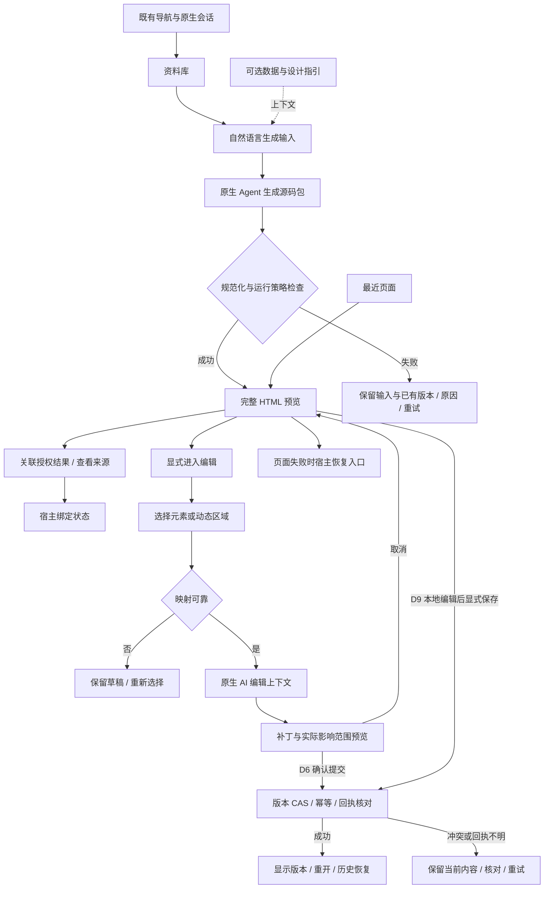
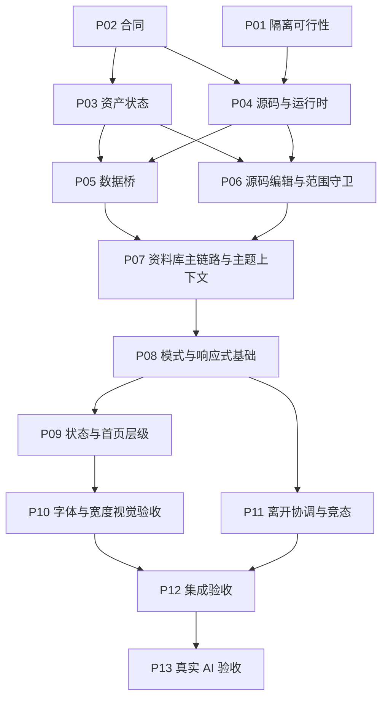

# 页面、交互节点与施工依赖

这些图是已批准方案的交接表达，不是新增产品要求、最终视觉稿或强制生成模板。宿主节点 N01–N16 用来分配实现和验收；AI 生成页面内部仍可自由组织 HTML/CSS/JavaScript。

## 页面结构

```text
资料库首页
┌ N01 既有 SHINE / DSH 导航 ──────────────────────────────┐
│ N02 资料库定位：最近 / 我的文档 / 资料                   │
│                                                        │
│ 从资料库开始工作                                       │
│ ┌ N03 描述想生成的页面……                     [生成] ┐ │
│ │ N04 可选：[添加数据] [DESIGN.md / skill]            │ │
│ └───────────────────────────────────────────────────┘ │
│ N05 最近继续工作：名称 / 时间 / 状态 / 打开             │
│     资料和数据按需展开；空库也保留生成入口               │
└────────────────────────────────────────────────────────┘

页面工作区（示意；宽度规则见下表）
┌ N01 既有导航 ───────────────────────────────────────────┐
│ N02 返回资料库 / 切换资产                               │
│ N06 页面名 | 示例/绑定/过期 | 待保存/冲突 | 当前主动作   │
│ ┌ N07 完整自由页面预览 ─────────┬ 单一上下文区域 ──────┐│
│ │ 默认浏览，页面按钮和图表可用  │ N10 原生 AI 编辑     ││
│ │ N08 显式进入编辑模式          │       或 N12 来源    ││
│ │ N09 可定位元素/动态区域选区   │       或 N13 历史    ││
│ │     [AI 编辑] [属性] [取消]   │ N11 补丁差异/确认    ││
│ └──────────────────────────────┴──────────────────────┘│
│ N15 宿主错误/重启入口，独立于生成页面                    │
└────────────────────────────────────────────────────────┘
N14：有实际未保存修改的离开意图 → 保存并离开 / 放弃 / 留页
N16：窄屏面板有返回，关闭恢复焦点、输入、选区和滚动
```

N10 使用原生 Agent 与会话能力。首页输入框和按需编辑侧栏都不能消除原生聊天入口，也不能引入第二个聊天运行时。

| 宽度/情况 | 宿主布局与恢复 |
|---|---|
| 1440px | 全局导航与工作区常驻，资料库导轨可折叠；右侧只开一个上下文面板 |
| 1280px 及以下 | 资料库导轨默认收起，不和上下文面板同时挤占预览 |
| 768px | 紧凑导航，来源/历史/编辑以覆盖面板打开 |
| 375px | 单一工作区，全屏上下文面板有明确返回；标题/可信状态/主动作可达 |
| 200% 缩放、横竖屏、侧栏展开 | 记录 iframe 实际可用宽度；大表/画布在局部滚动，关闭面板恢复操作位置 |

## 交互流程



图中的 D6 和 D9 是两类已批准提交路径，不允许同一次确认创建两次版本。进入/退出编辑、关闭面板、取消选区都不等于保存。数据绑定变化与源码包组成同一原子版本；回滚后重新核验当前授权。

## 局部编辑范围（D48）

```text
用户选择
  ├─ 静态元素 + 有效映射 → 精确源码范围
  ├─ 动态图表 / Canvas + 可靠所属区域 → 明示区域范围
  └─ 映射失效 / 区域不可靠 → 保留源码和草稿，重新选择

整页范围：只有用户主动切换才允许
共享 CSS/JS 影响：补丁预览显示实际扩展范围，等待对应确认
取消/过期/失败：不提交有效版本；不能用整页重生成“救场”
```

## 导航与迟到响应（D40–D47）

```text
资料库 / 返回对话 / 全局面板 / 会话切换 / 关闭
                  ↓ 单一 leave coordinator
              hasUnsavedChanges ?
    否（只有干净选区）                是
              │          保存并离开 / 放弃 / 留页
              │          ├─ 成功且回执匹配 → 原导航一次
              │          └─ 失败/冲突/未知 → 留页保留草稿
              └──────────→ 原导航一次

新导航意图 → epoch 推进
  旧 get/list/preview 成功或失败 → 丢弃，不覆盖新页或新错误
  保存回执晚到 → 独立按幂等键/CAS 核对，不作为普通读取丢弃
```

这张图描述目标行为，T22 的真实宿主接缝仍要验证。普通 beforeunload 不能代替 DSH 面板导航协调，也不能保证强制退出时异步保存。

## 节点对照表

| 节点 | 用户动作/职责 | 最终决定 | 主要施工批次 | 失败与验收重点 |
|---|---|---|---|---|
| N01 | 既有导航、原生聊天入口 | D24/D39/D41 | P07/P11 | 会话可达、全局离开受协调 |
| N02 | 资料库定位与切换资产 | D24/D33/D34 | P07/P09/P11 | 折叠、无权限、带脏稿切换 |
| N03 | 自然语言输入与生成 | D1/D25/D27/D34 | P07 | 无数据也生成；失败保留输入 |
| N04 | 可选数据/设计指导 | D27/D28/D31 | P07 | 未读到指引不谎称遵循 |
| N05 | 最近页面与资料列表 | D4/D24/D34 | P03/P07/P09 | 空库、无匹配、真实资产 |
| N06 | 页面名、可信与保存状态 | D8/D25/D32/D33 | P05/P07/P09 | 示例/部分绑定/过期/冲突可并存 |
| N07 | 自由 HTML 运行预览 | D2/D7/D13/D20/D23 | P01/P04 | 源码保真、失控隔离、外联边界 |
| N08 | 显式浏览/编辑切换 | D30 | P08 | 浏览事件不劫持；退出不自动保存 |
| N09 | 元素或区域选择与浮层 | D5/D10/D30/D48 | P06/P08 | 动态区域、失效重选、键盘入口 |
| N10 | 原生 Agent 编辑侧栏 | D5/D6/D24/D33 | P06/P07/P08 | 默认选区上下文；无第二 Agent |
| N11 | 补丁差异、影响范围、确认取消 | D6/D9/D48 | P06/P08 | 幂等、过期、无静默扩大范围 |
| N12 | 绑定检查与来源恢复 | D3/D8/D11/D18/D21 | P05/P09 | 越权/撤销/单位范围版本不符 |
| N13 | 保存、版本与历史恢复 | D4/D6/D9/D12 | P03/P07/P11 | 原子 manifest、CAS、重开落盘 |
| N14 | 未保存离开保护 | D40–D47 | P11 | 三选、单次导航、晚回执 |
| N15 | 宿主错误、停止/重启恢复 | D15/D20/D23/D25 | P01/P04/P07 | 页面停止后宿主可操作，草稿归属 |
| N16 | 窄屏、焦点与可访问性 | D29/D35/D38 | P08/P09/P10/P11 | 实际内容宽、键盘/读屏、返回恢复 |

P12 覆盖集成，P13 覆盖真实 AI 样本。节点表不是运行时 DOM ID 规范，也不是页面只能有这些元素。

## 施工依赖图



图展示主要交接边；完整前置取 manifest/各提示词。箭头不表示共享目录可随意并行：默认按 P01→P13 顺序，只有 P03/P04 是已规划的独立实现方向。每批次都要做自己的验证，P12 不负责补齐前面没写的基本测试。
